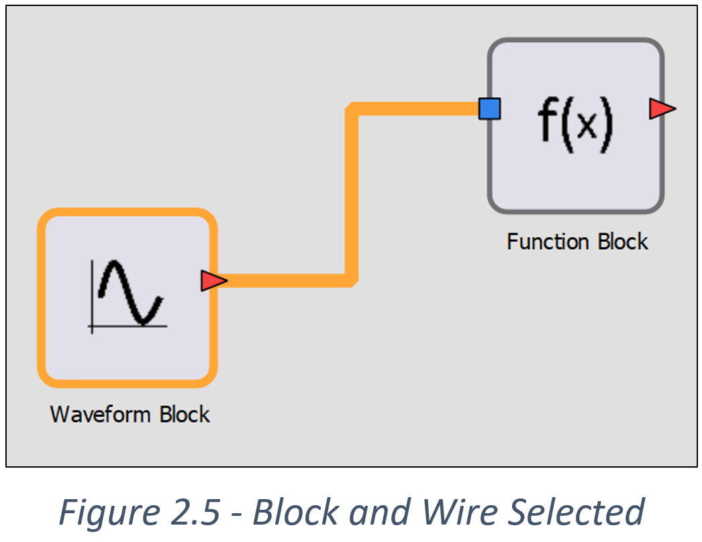
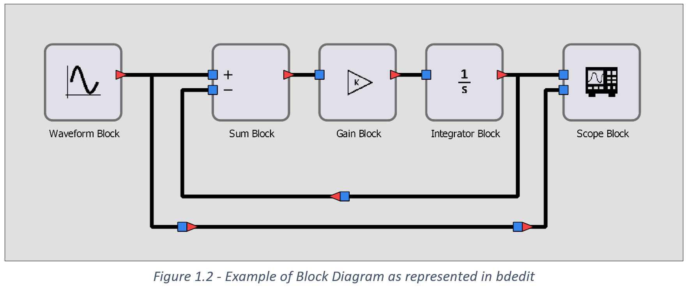
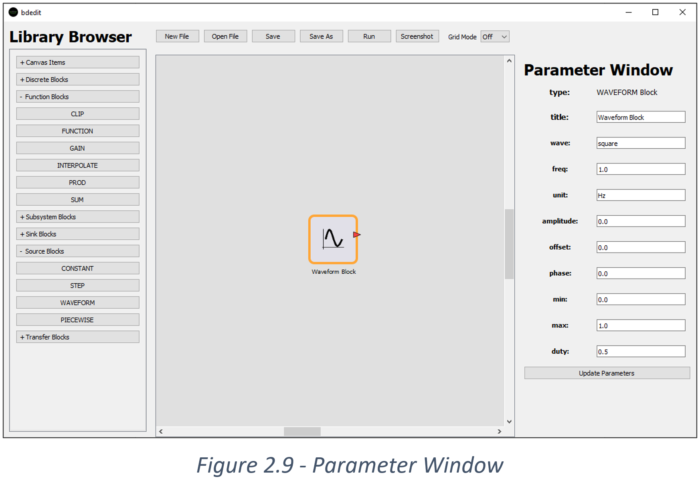
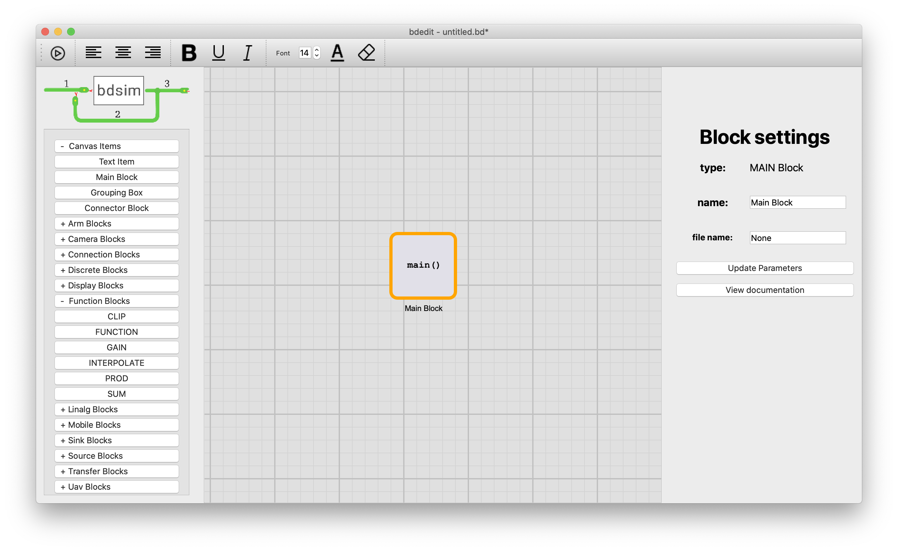
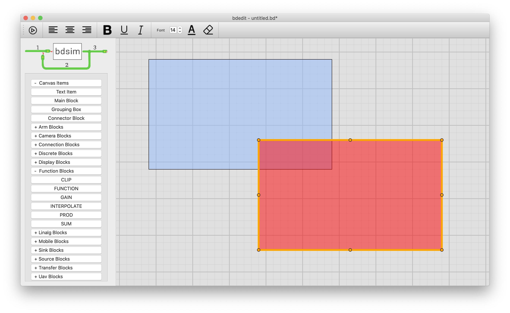

`bdedit` is a multi-platform PyQt5-based graphical tool to create, edit, render and execute block diagram models.


Key features include:

  * allows graphical creation of block diagrams
  * the diagram is stored in a human readable/editable JSON file with extension `.bd`
  * creates good-quality graphics for inclusion in publications
  * can launch `bdsim` to import and execute the model
  * automatically discovers all bsdim and toolbbox blocks and adds them to the block library menu
  * icons can be easily created using any image creation tool or a LaTeX expression 

# Getting started

From the examples folder
```
% bdedit eg1.bd
```
will create a display like that shown above.  

To run an existing `.bd` file
```
% bdrun eg1.bd
```
which will:

* parse the JSON file
* instantiate all blocks and wires
* compile and run the diagram

It takes standard options like
```
% bdrun +g -a eg1.bd
```
to enable graphics but disable animation.

Pushing the run button, top left (triangle in circle) will save the file then spawn `bdrun` as a subprocess.

## Adding a block

Click a block from the library panel on the left-hand side.  Each category is initially closed,
click it, to open it and reveal the blocks within.

All blocks, when added are instantiated in the middle of the canvas.

The key elements of a block are:
* input ports, small blue boxes
* output ports, small red triangles or arrow heads
* icon, which occupies the middle of the box (a 250x250 PNG image)
* block label, beneath the block, must be unique in the diagram
* block class, this appears when you hover the cursor over a block
* port labels, small text inside the box, against input and/or output ports. 
  Most ports don't have port labels.
* parameters, these are set by right clicking the block, see [details here](block-parameters).

Blocks can be flipped by typing "f" while the block is selected.

## Wiring blocks together

* Click one port then click another port, or
* Click and drag from one port to another.

An output port can connect to an arbitrary number of input ports.

## Selecting and moving elements


All selected elements, wires or blocks have an orange highlight when selected.
You can drag a region to select all blocks and wires within.

Selected items can be moved: click and drag them.  Blocks cannot be resized.

Selected wires can be adjusted:
* horizontal segments can be dragged up and down, 
* vertical segments can be dragged left or right.

## Connectors



The wire dragging is a little limited, and sometimes it is hard to get the layout you want. In this
case try adding a "Connector" from the "Canvas Items" category.  Run a wire to the input of the connector
and one or more wires from the output of the connector.  You can drag the connector by dragging it, click
close to, but not on, the connector to highlight it.  A wire can have an arbitrary number of connectors in it.

## Block parameters


Right clicking a block opens a panel on the right.  The parameters are initialized to values taken
from the docstring for the block.

Make changes and then click "Update parameters".  This will check validity of the types and values.

Click "View documentation" will open a browser window at the GitHub documentation page for the block 
class.

Block parameters can be:

* constants

* a native Python expression, prefix it with an equal sign, for example
`=[x**2 for x in range(10)]`.  

* an expression which relies on global variables or other run-time context, add a Main block
  to the diagram.  It contain the name of a Python script (by definition, for a block diagram `model` it would be `model-main.py` which will be spawned when you hit
  the Run button.  This can create the runtime environment, load the `.bd` file,
  for example:

    ```
    from bdsim import bdload, BDSim

    sim = BDSim() #debug='i')
    bd = sim.blockdiagram()

    lmbda = 0.08

    bd = bdload(bd, "IBVS.bd", globals=globals())
    bd.compile()
    bd.report()

    out = sim.run(bd, 100)
    print(out)
    ```*



# Grouping boxes



These are transparent colored boxes that are drawn below all other graphical
items.  They can be used to add structure to the diagrams.

# Free text

Click `Canvas Items/Text Item` to drop a default string `Text` onto the canvas.
Select the text to edit it.  Formatting options are in the toolbar.  Multiline
text with left/right/centred alignment is supported.

# Further details

More detail about how the tool works and key datastructures are in the [technical report](TechReport.md).  This is a little dated now, and the visual appearance
of the GUI has evolved.
