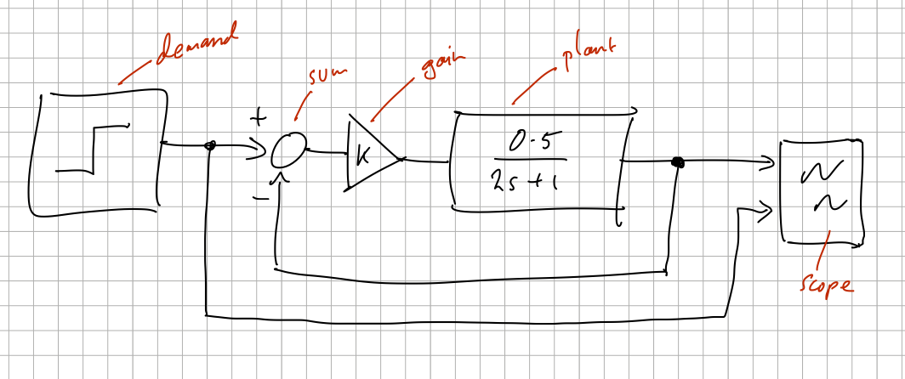

*********
Overview
*********

Getting started
================

We first sketch the dynamic system we want to simulate as a block diagram, for example this simple first-order system:

which we can express concisely with ``bdsim`` as (see `bdsim/examples/eg1.py <https://github.com/petercorke/bdsim/blob/master/examples/eg1.py>`_):

.. code-block:: python
   :linenos:

   import bdsim

   sim = bdsim.BDSim()  # create simulator
   bd = sim.blockdiagram()  # create an empty block diagram

   # define the blocks
   demand = bd.STEP(T=1, name='demand')
   sum = bd.SUM('+-')
   gain = bd.GAIN(10)
   plant = bd.LTI_SISO(0.5, [2, 1], name='plant')
   scope = bd.SCOPE(styles=['k', 'r--'], movie='eg1.mp4')

   # connect the blocks
   bd.connect(demand, sum[0], scope[1])
   bd.connect(sum, gain)
   bd.connect(gain, plant)
   bd.connect(plant, sum[1], scope[0])

   bd.compile()   # check the diagram
   bd.report_summary()    # list all blocks and wires

   out = sim.run(bd, 5)  # simulate for 5s

   print(out)

This example utilizes just 16 lines of executable code. The red block annotations on the
hand-drawn diagram correspond to the variable names holding references to the block
instances. 

* **Lines 7-11** defines the blocks used in the model. Blocks can have user-assigned names (see lines 7 and 10), which are useful for diagnostics and plot labels.

* **Lines 14-17** connects the blocks together. In ``bdsim``, all wires are
  point-to-point, so a **one-to-many** connection is implemented by defining multiple wires.
  The first argument to ``connect`` is the source block, and subsequent arguments are destination blocks. 

  .. code-block:: python

      bd.connect(source, dest1, dest2, ...)

  Ports are designated using Python indexing notation; for instance, ``block[2]`` refers
  to the third port of the block. Context determines if a port is an input or output: an
  index on the first argument of ``connect`` refers to an output, while subsequent
  arguments refer to inputs. If a block has only one port, the index 0 is assumed.

  Groups of ports can be denoted using slice notation, for example:

  .. code-block:: python

      bd.connect(source[2:5], dest[3:6])

  connects ``source[2]`` to ``dest[3]``, ``source[3]`` to ``dest[4]``, and ``source[4]`` to ``dest[5]``.

*  **Line 19** assembles the blocks, checks connectivity to create a flat wire list, and builds the dataflow execution plan.
*  **Line 20** generates a tabular report summarizing the diagram's blocks and wires.

   .. code-block:: text

      ┌─────────┬────┬────┬──────────┬────────┬────────┬─────────────┐
      │  block  │ nc │ nd │   type   │ inport │ source │ source type │
      ├─────────┼────┼────┼──────────┼────────┼────────┼─────────────┤
      │ demand@ │ 0  │ 0  │ step     │        │        │             │
      ├─────────┼────┼────┼──────────┼────────┼────────┼─────────────┤
      │ gain.0  │ 0  │ 0  │ gain     │ 0      │ sum.0  │ float64     │
      ├─────────┼────┼────┼──────────┼────────┼────────┼─────────────┤
      │ plant   │ 1  │ 0  │ lti_siso │ 0      │ gain.0 │ float64     │
      ├─────────┼────┼────┼──────────┼────────┼────────┼─────────────┤
      │ scope.0 │ 0  │ 0  │ scope    │ 0      │ plant  │ float64     │
      │         │    │    │          │ 1      │ demand │ int         │
      ├─────────┼────┼────┼──────────┼────────┼────────┼─────────────┤
      │ sum.0   │ 0  │ 0  │ sum      │ 0      │ demand │ int         │
      │         │    │    │          │ 1      │ plant  │ float64     │
      └─────────┴────┴────┴──────────┴────────┴────────┴─────────────┘

*  **Line 22** executes the simulation for the specified duration (5 seconds).
*  **Line 26** (if uncommented) saves the scope content to a file named ``scope0.pdf``.
*  **Line 27** blocks the script execution until figure windows are closed or a SIGINT is received.

The simulation results are returned in a simple container object:

.. code-block:: python

   >>> print(out)
   t      = ndarray:float64 (123,)
   x      = ndarray:float64 (123, 1)
   xnames = ['plant:x_0'] (list)      

To record additional simulation variables, use a ``WATCH`` block or the ``watch`` option in ``run``:

.. code-block:: python

   >>> out = sim.run(bd, 5, watch=[plant, demand])
   >>> print(out)
   t      = ndarray:float64 (123,)
   x      = ndarray:float64 (123, 1)
   xnames = ['plant:x_0'] (list)
   y      = ndarray:float64 (123, 2)
   ynames = ['demand', 'sum.0'] (list)
   >>> plt.plot(out.t, out.y[:,0], 'k', out.t, out.y[:,1], 'r--')

Using operator overloading
--------------------------

Wiring and arithmetic blocks like ``GAIN``, ``SUM``, and ``PROD`` explicitly is somewhat tedious.
An alternative is to implicitly
generate and wire arithmetic blocks (``GAIN``, ``SUM``, ``PROD``) using overloaded Python operators, striking a balance between block diagram
logic and Pythonic programming:

.. code-block:: python
   :linenos:

   import bdsim

   sim = bdsim.BDSim()
   bd = sim.blockdiagram()

   # define the blocks
   demand = bd.STEP(T=1, name='demand')
   plant = bd.LTI_SISO(0.5, [2, 1], name='plant')
   scope = bd.SCOPE(styles=['k', 'r--'], movie='eg1.mp4')

   # connect the blocks
   scope[0] = plant
   scope[1] = demand
   plant[0] = 10 * (demand - plant)

   bd.compile()
   bd.report()

   out = sim.run(bd, 5)
   print(out)

   sim.done(bd, block=True)

This approach requires fewer lines of code and is arguably is more readable, while
producing *exactly the same* underlying block diagram. Implicitly created blocks are
automatically named with an underscore prefix.

A list of available blocks can be obtained by::

   >>> sim.blocks()
   bdsim.blocks.connections................: ITEM DICT MUX DEMUX INDEX SUBSYSTEM INPORT OUTPORT 
   bdsim.blocks.continuous.................: INTEGRATOR POSEINTEGRATOR LTI_SS LTI_SISO DERIV2 DERIV PID 
   bdsim.blocks.displays...................: SCOPE SCOPEXY SCOPEXY1 
   bdsim.blocks.functions..................: SUM PROD GAIN POW CLIP FUNCTION INTERPOLATE 
   bdsim.blocks.linalg.....................: INVERSE TRANSPOSE NORM FLATTEN SLICE2 SLICE1 DET COND 
   bdsim.blocks.sampled....................: ZOH INTEGRATOR_S POSEINTEGRATOR_S DERIV_S LTI_SS_S LTI_SISO_S PID_S 
   ........................................: DPOSEINTEGRATOR 
   bdsim.blocks.sinks......................: PRINT STOP EVENT NULL WATCH 
   bdsim.blocks.sources....................: CONSTANT TIME WAVEFORM PIECEWISE STEP RAMP 
   roboticstoolbox.blocks.arm..............: FKINE IKINE JACOBIAN ARMPLOT JTRAJ CTRAJ CIRCLEPATH TRAPEZOIDAL TRAJ IDYN 
   ........................................: GRAVLOAD_X INERTIA INERTIA_X FDYN FDYN_X 
   roboticstoolbox.blocks.mobile...........: BICYCLE UNICYCLE DIFFSTEER VEHICLEPLOT 
   roboticstoolbox.blocks.spatial..........: TR2DELTA DELTA2TR POINT2TR TR2T 
   roboticstoolbox.blocks.uav..............: MULTIROTOR MULTIROTORMIXER MULTIROTORPLOT 
   machinevisiontoolbox.blocks.camera......: CAMERA VISJAC_P ESTPOSE_P IMAGEPLANE 

More details can be found at:

- `Wiki page <https://github.com/petercorke/bdsim/wiki>`_
   - `Adding blocks <https://github.com/petercorke/bdsim/wiki/Adding-blocks>`_
   - `Connecting blocks <https://github.com/petercorke/bdsim/wiki/Connecting-blocks>`_
   - `Running the simulation <https://github.com/petercorke/bdsim/wiki/Running>`_
- :ref:`Block library`

