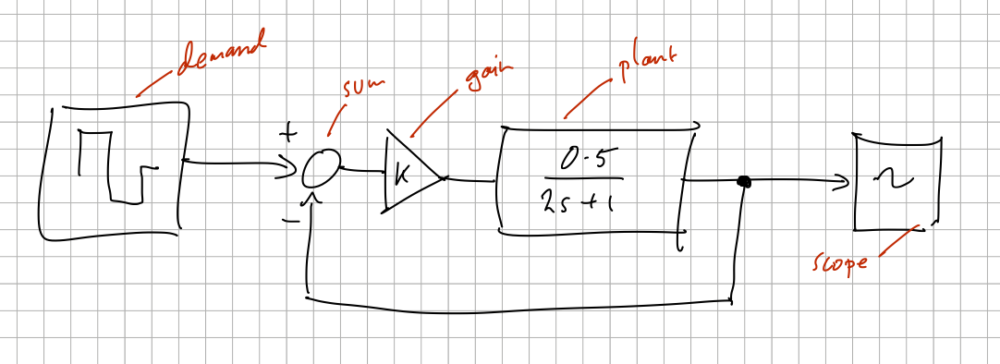
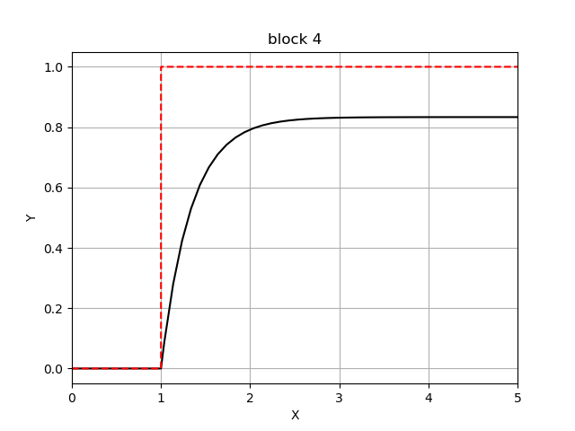

Overview
========

Getting started
---------------

We first sketch the dynamic system we want to simulate as a block diagram, for example this simple first-order system

which we can express concisely with `bdsim` as (see `bdsim/examples/eg1.py <https://github.com/petercorke/bdsim/blob/master/examples/eg1.py>`_)

.. code-block:: python
   :linenos:

   import bdsim

   sim = bdsim.BDSim()  # create simulator
   bd = sim.blockdiagram()  # create an empty block diagram

   # define the blocks
   demand = bd.STEP(T=1, name='demand')
   sum = bd.SUM('+-')
   gain = bd.GAIN(10)
   plant = bd.LTI_SISO(0.5, [2, 1], name='plant')
   scope = bd.SCOPE(styles=['k', 'r--'], movie='eg1.mp4')

   # connect the blocks
   bd.connect(demand, sum[0], scope[1])
   bd.connect(sum, gain)
   bd.connect(gain, plant)
   bd.connect(plant, sum[1], scope[0])

   bd.compile()   # check the diagram
   bd.report()    # list all blocks and wires

   out = sim.run(bd, 5)  # simulate for 5s

   print(out)

   # sim.savefig(scope, 'scope0') # save scope figure as scope0.pdf
   sim.done(bd, block=True)  # keep figures open on screen

which is just 16 lines of executable code.

The red block annotations on the hand-drawn diagram are used as the names of the variables holding references to the block instance. The blocks can also have user-assigned names, see lines 8 and 11, which are used in diagnostics and as labels in plots.

After the blocks are created their input and output ports need to be connected. In `bdsim` all wires are point to point, a *one-to-many* connection is implemented by *many* wires,
for example::

   bd.connect(source, dest1, dest2, ...)

creates individual wires from `source` -> `dest1`, `source` -> `dest2` and so on.
Ports are designated using Python indexing notation, for example `block[2]` is port 2 (the third port) of `block`.  Whether it is an input or output port depends on context.
In the example above an index on the first argument refers to an output port, while on the second (or subsequent) arguments it refers to an input port.  If a block has only a single input or output port then no index is required, 0 is assumed.

A group of ports can be denoted using slice notation, for example::

   bd.connect(source[2:5], dest[3:6)

will connect ``source[2]`` -> ``dest[3]``, ``source[3]`` -> ``dest[4]``, ``source[4]`` -> ``dest[5]``.
The number of wires in each slice must be consistent.  You could even do a cross over by connecting ``source[2:5]`` to ``dest[6:3:-1]``.

Line 20 assembles all the blocks and wires, instantiates subsystems, checks connectivity to create a flat wire list, and then builds the dataflow execution plan.

Line 21 generates a report, in tabular form, showing a summary of the block diagram:

.. code-block::

   Blocks::

   ┌───┬─────────┬─────┬──────┬────────┬─────────┬───────┐
   │id │    name │ nin │ nout │ nstate │ ndstate │ type  │
   ├───┼─────────┼─────┼──────┼────────┼─────────┼───────┤
   │ 0 │  demand │   0 │    1 │      0 │       0 │ step  │
   │ 1 │   sum.0 │   2 │    1 │      0 │       0 │ sum   │
   │ 2 │  gain.0 │   1 │    1 │      0 │       0 │ gain  │
   │ 3 │   plant │   1 │    1 │      1 │       0 │ LTI   │
   │ 4 │ scope.0 │   2 │    0 │      0 │       0 │ scope │
   └───┴─────────┴─────┴──────┴────────┴─────────┴───────┘

   Wires::

   ┌───┬──────┬──────┬──────────────────────────┬─────────┐
   │id │ from │  to  │       description        │  type   │
   ├───┼──────┼──────┼──────────────────────────┼─────────┤
   │ 0 │ 0[0] │ 1[0] │ demand[0] --> sum.0[0]   │ int     │
   │ 1 │ 0[0] │ 4[1] │ demand[0] --> scope.0[1] │ int     │
   │ 2 │ 3[0] │ 1[1] │ plant[0] --> sum.0[1]    │ float64 │
   │ 3 │ 1[0] │ 2[0] │ sum.0[0] --> gain.0[0]   │ float64 │
   │ 4 │ 2[0] │ 3[0] │ gain.0[0] --> plant[0]   │ float64 │
   │ 5 │ 3[0] │ 4[0] │ plant[0] --> scope.0[0]  │ float64 │
   └───┴──────┴──────┴──────────────────────────┴─────────┘

The simulation results are returned in a simple container object::

   >>> out
   results:
   t           | ndarray (67,)
   x           | ndarray (67, 1)
   xnames      | list              

where

- `t` the time vector: ndarray, shape=(M,)
- `x` is the state vector: ndarray, shape=(M,N), one row per timestep
- `xnames` is a list of the names of the states corresponding to columns of `x`, eg. "plant.x0"

To record additional simulation variables we "watch" them. This can be specified by
wiring the signal to a WATCH block, or more conveniently by an additional option to
``run``::

   out = sim.run(bd, 5, watch=[plant,demand])  # simulate for 5s

and now the result ``out`` has additional elements::

   >>> out
   results:
   t           | ndarray (67,)
   x           | ndarray (67, 1)
   xnames      | list        
   y0          | ndarray (67,)
   y1          | ndarray (67,)
   ynames      | list   

where

- `y0` is the time history of the first watched signal
- `y1` is the time history of the second watched signal
- `ynames` is a list of the names of the states corresponding to columns of `x`, eg. "plant[0]"

Line 27 saves the content of the scope to be saved in the file called `scope0.pdf`.

Line 28 blocks the script until all figure windows are closed, or the script is killed with SIGINT.

Line 29 saves the scope graphics as a PDF file.

Line 30 blocks until the last figure is dismissed.

A list of available blocks can be obtained by::

   >>> sim.blocks()
      73  blocks loaded
      bdsim.blocks.functions..................: Sum Prod Gain Clip Function Interpolate 
      bdsim.blocks.sources....................: Constant Time WaveForm Piecewise Step Ramp 
      bdsim.blocks.sinks......................: Print Stop Null Watch 
      bdsim.blocks.transfers..................: Integrator PoseIntegrator LTI_SS LTI_SISO 
      bdsim.blocks.discrete...................: ZOH DIntegrator DPoseIntegrator 
      bdsim.blocks.linalg.....................: Inverse Transpose Norm Flatten Slice2 Slice1 Det Cond 
      bdsim.blocks.displays...................: Scope ScopeXY ScopeXY1 
      bdsim.blocks.connections................: Item Dict Mux DeMux Index SubSystem InPort OutPort 
      roboticstoolbox.blocks.arm..............: FKine IKine Jacobian Tr2Delta Delta2Tr Point2Tr TR2T FDyn IDyn Gravload 
      ........................................: Inertia Inertia_X FDyn_X ArmPlot Traj JTraj LSPB CTraj CirclePath 
      roboticstoolbox.blocks.mobile...........: Bicycle Unicycle DiffSteer VehiclePlot 
      roboticstoolbox.blocks.uav..............: MultiRotor MultiRotorMixer MultiRotorPlot 
      machinevisiontoolbox.blocks.camera......: Camera Visjac_p EstPose_p ImagePlane 

More details can be found at:

- `Wiki page <https://github.com/petercorke/bdsim/wiki>`_
   - `Adding blocks <https://github.com/petercorke/bdsim/wiki/Adding-blocks>`_
   - `Connecting blocks <https://github.com/petercorke/bdsim/wiki/Connecting-blocks>`_
   - `Running the simulation <https://github.com/petercorke/bdsim/wiki/Running>`_
- :ref:`Block library`

Using operator overloading
--------------------------

Wiring, and some simple arithmetic blocks like GAIN, SUM and PROD can be implicitly generated by overloaded Python operators.  This strikes a nice balance between block diagram coding and Pythonic programming.

.. code-block:: python
   :linenos:

   import bdsim

   sim = bdsim.BDSim()  # create simulator
   bd = sim.blockdiagram()  # create an empty block diagram

   # define the blocks
   demand = bd.STEP(T=1, name='demand')
   plant = bd.LTI_SISO(0.5, [2, 1], name='plant')
   scope = bd.SCOPE(styles=['k', 'r--'], movie='eg1.mp4')

   # connect the blocks
   scope[0] = plant
   scope[1] = demand
   plant[0] = 10 * (demand - plant)

   bd.compile()   # check the diagram
   bd.report()    # list all blocks and wires

   out = sim.run(bd, 5)  # simulate for 5s
   # out = sim.run(bd, 5 watch=[plant,demand])  # simulate for 5s
   print(out)

   # sim.savefig(scope, 'scope0') # save scope figure as scope0.pdf
   sim.done(bd, block=True)  # keep figures open on screen

This requires fewer lines of code and the code is more readable. 
Importantly, it results in in *exactly the same* block diagram in terms of blocks and wires::

   ┌───┬──────┬──────┬──────────────────────────────┬─────────┐
   │id │ from │  to  │         description          │  type   │
   ├───┼──────┼──────┼──────────────────────────────┼─────────┤
   │ 0 │ 1[0] │ 2[0] │ plant[0] --> scope.0[0]      │ float64 │
   │ 1 │ 0[0] │ 2[1] │ demand[0] --> scope.0[1]     │ int     │
   │ 2 │ 0[0] │ 3[0] │ demand[0] --> _sum.0[0]      │ int     │
   │ 3 │ 1[0] │ 3[1] │ plant[0] --> _sum.0[1]       │ float64 │
   │ 4 │ 3[0] │ 4[0] │ _sum.0[0] --> _gain.0(10)[0] │ float64 │
   │ 5 │ 4[0] │ 1[0] │ _gain.0(10)[0] --> plant[0]  │ float64 │
   └───┴──────┴──────┴──────────────────────────────┴─────────┘

The implicitly created blocks have names prefixed with an underscore.